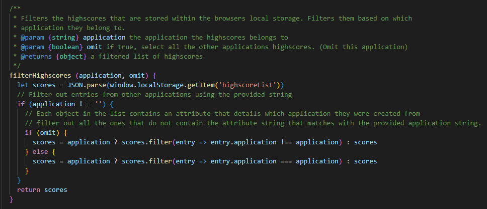

# Personal Web Desktop

## Window features
### Minimizing
A window within the Single Page Application is able to be minimized. Each window contains a set of buttons in the window header, a minimize button and a close button. The close button simply removes the object (deleting it) while the minimize button instead hides the window using CSS Styling's visibility attribute. 

This was therefore achieved by using CSS styling, where a new class named 'minimizing' is used in CSS. The class contains a transition attribute which means that it transitions from an original value to a desired value in a timeframe. I set this to be 0.5 seconds for both the height and opacity before both of them reach 0. This would mean that for 0.5 seconds, with the ease argument, it smoothly lowers its height and opacity value down to zero. Why I chose to implement this was because I wanted the windows to 'fade' away.

The javascript code that displays the event listener for the minimize button, and the minimizing class in CSS, can be observed in the following image.

### Draggable header
A window within the Single Page Application is only draggable on their window header. This both simulates how a common operating system like Windows handles draggability. It also removes problems that could arise when a user is interacting with the content within an application, such as dragging the chat application by mistake when interacting with the chat log.

### Taskbar
As I wanted to simulate the experience of using a personal computer with the PWD, each application is added to the taskbar when initiated. When an application is launched, it inserts their icon in the taskbar. The taskbar icon can be interacted with where, when clicked, it selects the application window it belongs to as active. This makes the window be the one in focus, which also moves it on-top of the other windows. If the application was hidden prior to clicking the taskbar icon, it will be visible again.

#### How it keeps track of active windows
In order to keep track of all the active windows, I have chosen to implement a CSS class that is used only for active items. Where an active window means that it will be displayed with a higher Z-index than non-active windows. Which in turn means that the window will be displayed on-top of other windows when active (being in focus for the user). To make a window active and all the other windows inactive, I can then search through the webpage (the document) to find all the items that contains the active class. It is then possible to remove the active class from each of the items and then apply it to the window that was interacted with. I then added event listeners to the body of a window item, which would mean that the eventlistener is triggered each time a user clicks on a window. I also added this functionality into the taskbar icons.  

The function that handles this behavior can be viewed in the following image.

## Storing Highscores

For the game applications there exists a highscore list, where each score that gets set is compared to the last score in the list. Based on the type of highscore list ordering (ascending or descending) the new score should either be lower or higher than the last score in the list in order to replace it. For example, in the Memory application the scores are the times of each entry (how long it took until the player found all the pairs). Thus a better score would mean a lower time than the others in the list. While the snake application would instead value higher scores (how much food the snake consumed). 

The list only accepts up to a determined number of scores (which is set by the application that utulizes it) 

The following image shows how the highscore list looks like when stored in the browser.

As could be seen within the stored list, it contains the highscores for both the Memory and Snake applications. It may have been a worse decision but I wanted to have one unified highscore variable stored in the browser, instead of multiple lists. This way I could simply reuse the same list and append new scores to it. In order to have the highscore lists display correclty to their corresponding application (snake application gets snake game scores, Memory gets memory scores), I implemented a way to filter the scores based on the application they were set for. The function that performs the filtering can be observed in the following image.

## Encryption
The SPA features a simple encryption that I have implemented. The encryption works on shifting each of the characters in a string up a step (as in, incrementing their UTF-8 value by 1) and then encoding the string into base64. The following images displays the encryption function as well as a visual example of what the string looks like during execution and the result.

## Privacy
With the use of the simple encryption that I implemented, I also encrypt some of the stored user data in the browser's local storage. This includes the username of a user (their chat username), the webserver they last connected to, the channel they last used as well as the current API key.

The following image displays how the userdata looks like after it has been encrypted prior to being stored in the browser's local storage.

# Applications
## Chat
The chat application functions as a tool to send and receive chat messages through a websocket connection. It connects to a websocket and if a message is received checks whether it contains valid JSON (would make it an object). If the message was valid JSON it can then be parsed as an object and the attributes of is able to be retrieved, such as the username and actual chat text message. 
### Features
#### Emoji support
The chat application supports an assorment of emoji, which can be accessed by clicking the emoji button near the send button. If the emoji button is clicked it reveals a grid of available emoji to choose from, where a chosen emoji will be appended to the current chat message in the input text box of the chat window. This means that a user is able to send messages containing just 1 or more emoji, or text accompanied with emoji. The emoji functionality can be observed in the following image. 

#### Encrypted communication
The chat application supports encrypted communication on a specific channel. If a user uses the channel 'encryptedChannel' all the chat messages will be encrypted when sent and decrypted when received. This leads to a private conversation between chat clients that access the channel. If an encrypted message were to be observed without being decrypted it be obfuscated and therefore lead to a lower possibility of understanding the chat message's content. This means that a client that managed to receive an ecrypted message, that was not supposed to understand it (it was not currently using the encrypted channel), would not be able to see the original message.

#### Options to change userdata
- **Change username**:
The chat application allows the user to change their username when prompted. The new username that a user chose will be effective immediately on all current or new chat applications.

- **Change webserver**: Similarly with the webserver, when a new webserver is entered it is effective immediately. Which closes the current websocket and opens a new one using the new webserver URL. All new chat applications will use the new webserver.

- **Change channel**: Like how the previous options function, this changes the current channel that the chat application uses.

#### Option to toggle local updates of the chat log
The chat log only updates when a chat message is received on the websocket by default. However, if the user is using a webserver that does not echo the sent message back to the client after sending it is possible to enable a local update of the chat log. Enabling local updates means that each message a user sends is inserted directly into the chat log manually. Which in turn means that the user is then able to see their message just like all the other clients views it.

#### Option to restore previous session of chat messages
The chat application stores the latest 20 chat messages every time a message is received. This has been implemented with the use of the local browser storage, where the list of chat messages is retrieved and then a new message is pushed into it. The oldest message (the first position in the chat log array) is then popped, which means that it is removed.

## Memory
### Features
#### Keyboard control
The user is able to control the Memory application by using the arrow keys on their keyboard. The movement in the grid will be shown visually to the player as outlines around the current selected tile. If the user wants to reveal an image they can then press their enter key while the tile is currently selected.

#### Card reveal hint
The Memory application also contains an extended feature that lets a user reveal all the cards for a brief moment, as a hint for all the images locations. This was implemented as a way for a user to lower the difficulity of the game, as they can reveal all the cards with a button press (they will not be regarded as paired cards). The intention is that the user themselves has to judge when they need the hint or not, if they feel stuck.

#### Highscore keeping
The Memory application has an extended feature implemented where it stores a player's time when they have found all the pairs. The highscores are then displayed as an end screen after each pair has been found, where a player's time might end up in the list if it was lower than the last entry (the slowest time in the top 5). The list is ordered with the lowest time first.

### Game Timer
The Memory application makes use of a module that functions as a timer. The timer records the time it was started and will check the current time each second, as it executes forever on a 1 second interval, and then calculates the duration it has been executing for (in seconds). This number can then be displayed as a timer that increments once per second. This has been used as a way to update the Memory application's footer with the duration of a player's current playing session. The last time that was recorded when a user found all the pairs, will then be used as their score in the highscore list; which means that a lower time is a better score. The code for this behavior can be obserbed in the following image.

## Snake

### Gamemodes
The following image displays the two selection screen that is available to the user. At first they can select between playing a singleplayer session or 2 player local multiplayer. The multiplayer mode makes use of a single keyboard, where both players can steer their respective snake at the same time.

After the user has selected either single player or multiplayer, they are greeted with a gamemode selection screen. There are currently 2 gamemodes to choose from, which changes the behavior of the game.
- Traditional
- Endless

#### Traditional
The traditional gamemode behaves like an ordinary game of snake, where the user can collect food to get higher score and become a longer snake. However, when a snake either crashes into itself or another player snake; the game ends. After the game has ended the Snake application displays a list of highscores, which is ordered based on highest score first. 

#### Endless
The endless gamemode removes the game ending behavior when a snake crashes into itself or another snake. In singleplayer this means that a player can continue to collect food and eventually become long enough to fill all the grid tiles. However, in multiplayer it behaves slightly differently. If a snake crashes into another snake in the multiplayer mode while playing the endless gamemode, they are reset. One of the snakes (depending on which was moving at that current game update) will lose all their points and has to start over at a random location on the board.

The different behaviors of the gamemodes can be viewed in the following GIF images.

  

    
    
  

  

    
  

## Paint
The paint application is a drawing application where a user is able to create images by manipulating a 20x20 grid of cells. The grid is a visual representation of the nested array that contains each of the values for the cells. Each cell has their background color set to the value that is stored in their respective position in the array. 

Each value, which are integer values, are associated with a color's name as as string; that is stored in an object. The drawing of the grid can then achieve colors by setting the background color to the color specified by the value in the position. This means that a user can directly manipulate a value that is stored at a position in the nested array. 
### Storing saved images
A user is able to save the images they create, which simply stores the current nested array (that is filled with the color values), in the browser's storage, complete with a name that a user chooses themselves.

The user can then also load images, which is achieved by retrieving the list of image objects in the browser's local storage. The user is then able to choose between the images in a menu that displays them all as buttons.

The following image displays how the images are stored in the browser's local storage.

