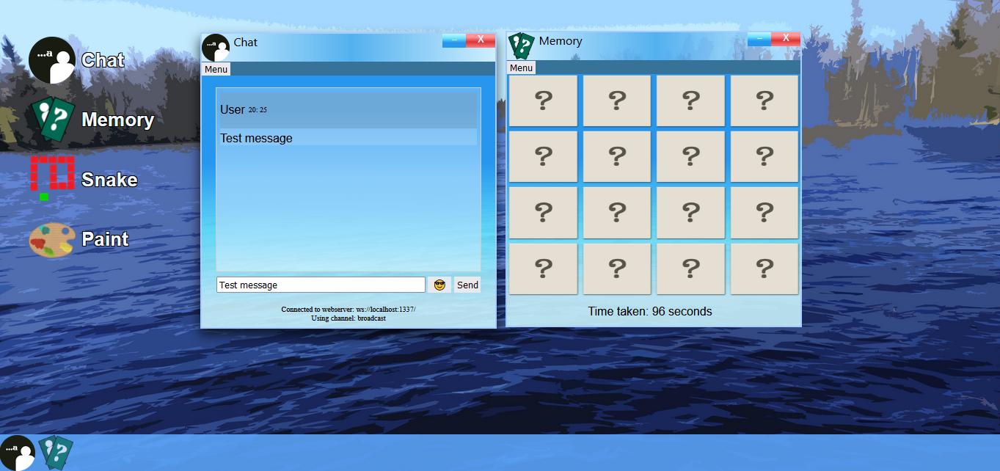
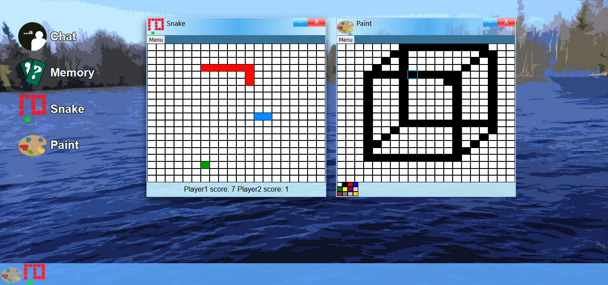

# Javascript SPA
## A Single Page Application (SPA) of a Personal Web Desktop (PWD)
The repository contains a Single Page Application that acts as an imitation of a desktop environment, with an assortment of applications that a user can interact with. 

The applications that are available are the following.
- A chat application
- A memory game application
- A Snake game application
- A drawing application



The image above showcases two of the main applications for the Personal Web Desktop, a chat application and a memory application. 


The image above showcases the two extra applications, Snake and Paint. 

The applications are written in javascript and acts as small window applications, where a user can use each of them independently. The windows are able to be dragged and moved around within the SPA, and their icons are added to the SPA's taskbar (bottom of the screen). Taskbar icons are also interactable and serves as a way for the user to make minimized (hidden) applications appear again. Which lets a user minimize an application and then have the option to return to said application later.


### Applications
#### Chat
The chat application can be connected to a webserver which lets a user send and receive messages. The application supports the following features.
- Change the current username
- Change which webserver it connects to
- Change the channel a user is currently listening to
- Toggle local updates (*1)
- Restore previous session (*2)
- Encryption of messages (*3)
- Emoji support

(*1) Toggle local updates is used when a user connects to a server that does not broadcast their message back to them when they've sent a message. Thus they can enable the chat application to manually insert their chat messages directly into the chat log when they've sent a message on one such server.


(*2) The chat application stores the 20 last receieved chat messages in the browser's local storage, which is then able to be restored whenever a user wants to. This means that they are able to return back to the chat application after a restart and restore the previous messages prior to the restart.

(*3) The chat application let's the user encrypt their messages in order to have an encrypted conversation on a certain channel. When a user changes over to the channel 'encryptedChannel', all messages that are sent and received are encrypted and decrypted accordingly. 
#### Memory
The Memory application is a 4x4 grid of images where the images are hidden from the player until interacted with. The player has to search for pairs of images and is only allowed to select two images at once, before they are hidden again if they were not a pair. When a user has found all the pairs they reach a highscore screen where their top 5 lowest times are displayed. The application also features a hint option, which reveals all the images for a brief amount of time before hiding them again. This serves as an option for the user to make the game easier, if they find it difficult to find more pairs.

#### Paint
The paint application is a drawing application that utulizes a grid and large pseudo-pixels to let a user be able to draw. The drawing process involves changing the color of a pixel in the grid to a desired selected color. The paint drawing application also supports saving a loading a drawn image, which saves the image within the browser's local storage.

#### Snake
The snake game application supports local 2 player multiplayer and 2 different gamemodes, Traditional and Endless. Traditional means that the game is over when a snake touches another snake or itself, while endless resets the snake back to 0 points when touching another snake. 

The snake game application also has a highscore system implemented, where players can get their scores recorded and are displayed each time the game ends.

Further reading about the features of the PWD and the applications can be read here: [Features](Features.md)

---
### Download instructions
This step prequires a terminal such a bash or CMD (if using a windows operating system).

There are two ways that accomplishes the same result, based on the methods taken. The user could start their terminal within a desired folder, or start elsewhere and then move into the folder by using commands such as 'cd *directory*'. Alternatively would be to initiate the download in another location (where their terminal is currently located) and then move the downloaded folder into a desired folder.

To initate the download, one way could be to use this command if using git
``` 
git clone 
```

This will clone the repository and result in a folder named "spa", which contains the application. 

The user can then enter the folder using the terminal with the following command.
```
cd spa
```


---
### Installation
**The application requires that the user has Node installed.**
The application makes use of linters and vite builder which are a part of the development environment. The linters function as helpful tools that correct written code into predetermined standards, this means moving lines that has incorrect indentation for example. If you as a user have cloned and downloaded this repository then you need to install the linters in order to be able to use them. 

To install the linters and vite builder open up a terminal within the cloned repository and run the following command.

```
npm install
```
After the install process has been completed, you can verify that the tools have been installed by running the following command.

```
npm run
```
This will list the available tools and the commands used to execute them, and the output should look like the following:
```
available via `npm run-script`:
  dev
    vite
  build
    vite build
  serve
    vite preview
  htmlhint
    npx htmlhint public src || exit 0
  stylelint
    npx stylelint **/*.css || exit 0
  stylelint:fix
    npx stylelint --fix **/*.css || exit 0
  eslint
    npx eslint . || exit 0
  eslint:fix
    npx eslint --fix . || exit 0
  jsdoc
    npx jsdoc -c .jsdoc.json || exit 0
  lint
    npm run htmlhint && npm run stylelint && npm run eslint
  clean
    rm -rf build/
  clean-all
    npm run clean && rm -rf node_modules/ && rm -f package-lock.json
```

When you have verified that the tools have been successfully installed, they can be executed using the following command. The command will run all the available linters in succession.

```
npm run lint
```

---
### Starting the application
When you have verified that the linters tools have been successfully installed and that they are able to run. Then you are able to start running the SPA, where you have a couple of alternatives to choose from.

#### Vite
If you want to run the application with the use of vite builder, then you have two alternatives to choose from. You could start the application by using the built distribution directory. This can be achieved with the following command.
```
npm run serve
```
Alternatively you could run the development environment with the source files directly, which can be ran using the following command.
```
npm run dev
```